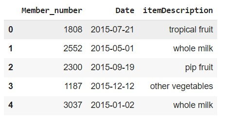

# Laporan Proyek Machine Learning
### Nama : Kresna Prayoga
### Nim : 211351071
### Kelas : Malam A

## Domain Proyek

Aplikasi ini adalah aplikasi yang menggunakan teknik machine learning dengan metode Apriori untuk memprediksi produk apa yang mungkin diminati oleh pelanggan berdasarkan riwayat pembelian mereka. Aplikasi ini dirancang untuk membantu perusahaan meningkatkan cross-selling dan merancang strategi pemasaran yang lebih efektif.

## Business Understanding

Aplikasi ini adalah penyedia solusi analisis data yang fokus pada meningkatkan efektivitas strategi cross-selling untuk perusahaan. Kami menghadirkan Aplikasi ini,sebagai platform inovatif yang memanfaatkan metode Apriori untuk memberikan wawasan mendalam tentang perilaku pembelian pelanggan.

Bagian laporan ini mencakup:

### Problem Statements

- Sulitnya Mengidentifikasi Peluang Cross-Selling.
- Kurangnya Pemahaman Mendalam tentang Pola Pembelian Pelanggan.
- Kesulitan dalam Menyesuaikan Taktik Pemasaran dengan Preferensi Individu.

### Goals

- Meningkatkan tingkat penjualan tambahan dengan memberikan rekomendasi produk yang relevan kepada pelanggan berdasarkan analisis pola pembelian.
- Mengoptimalkan pengeluaran pemasaran dengan menyediakan wawasan yang diperlukan untuk merancang kampanye yang lebih terarah dan efektif.
- Memberikan analisis yang mendalam tentang pola pembelian pelanggan untuk membantu perusahaan memahami perilaku belanja dan tren pasar.
- Menyesuaikan taktik pemasaran dengan preferensi individu pelanggan untuk meningkatkan relevansi dan respons kampanye.

## Data Understanding
Dataset ini berasal jadi Kaggle yang berisi riwayat tansaksi suatu toko grosir. Dataset ini mengandung 14963 baris dan 3 columns.<br> 


  [Groceries dataset](https://www.kaggle.com/datasets/heeraldedhia/groceries-dataset).

Selanjutnya uraikanlah seluruh variabel atau fitur pada data. Sebagai contoh:  

### Variabel-variabel yang di pakai pada Mobile Price Prediction adalah sebagai berikut:

- Member_number : ID of Member/Customer.<br> 
  type data : int64 <br> 
  range : 1000-5000 <br> 
- Date : Date of purchase.<br> 
  type data : datetime64 <br> 
  range : -<br> 
- itemDescription : Description of product purchased.<br> 
  type data : object <br> 
  range : -<br>

## Data Preparation

### Data Collecting

  Pengambilan data disini saya mendapatkan datasetnya dari dari website kaggle bernama Groceries dataset, untuk link datasets sudah saya attach di bagian #data understanding.
      
  adapun library yg saya gunakan kali ini yaitu :
  ```
  iimport pandas as pd
  import numpy as np
  import matplotlib.pyplot as plt
  import seaborn as sns
  from mlxtend.frequent_patterns import association_rules, apriori
  import networkx as nx
  import warnings
  ```
  
  Selanjutnya untuk import API Kaggle saya menggunkan Teknik berikut :
  
  ```
  from google.colab import files
  files.upload()  
  ```

  Lalu, untuk menyimpan file kaggle.json melalui google collab:

  ```
  !mkdir -p ~/.kaggle
  !cp kaggle.json ~/.kaggle/
  !chmod 600 ~/.kaggle/kaggle.json
  !ls ~/.kaggle
  ```

  Berikutnya, kita mendownload dataset dari keggle nya :

  ```
  !kaggle datasets download -d heeraldedhia/groceries-dataset
  ```

  setelah itu kita perlu mengekstrak dataset yg sudah didownload tadi:

  ```
  !mkdir groceries-dataset
  !unzip groceries-dataset
  !ls groceries-dataset
  ```


### Data Discovery and Visualization 

  Untuk bagian Data discovery saya menggunakan teknik EDA

  Setelah melakukan data collecting, maka kita perlu mendeskripsikan variabel :
  ```
  df.head()
  ```
  <br> 
  lalu, kita perlu cek collum yg ada di dataset :
  ```
  df.info()
  ```
  <br> 
  setelah itu kita perlu mencek isi dataset menggunakan df.describe :
  ```
  df.describe()
  ```
  <br> 

  lanjut visualisasi data yg pertama kita cek data top selling product :
  ```
  freq = (df['itemDescription'].value_counts())
  freq.head()
  ```
  dan kita buat jadi barplot:
  ```
  plt.figure(figsize = (15,5))
  bars = plt.bar(x = np.arange(len(freq.head(10))), height = (freq).head(10),color='grey')
  plt.bar_label(bars, fontsize=12, color='white', label_type = 'center')
  plt.xticks(ticks = np.arange(len(freq.head(10))), labels = freq.index[:10])

  plt.title('Top 10 Products by Support')
  plt.ylabel('Quantity')
  plt.xlabel('Product Name')
  plt.show()
  ```
  <br> 

  selanjutnya kita cek frekuensi pembelian tiap membernya :
  ```
  member_shopping_frequency = df.groupby('Member_number')['Date'].count().sort_values(ascending=False)
  print(member_shopping_frequency)
  ```
  ```
  sns.histplot(member_shopping_frequency, bins=8, kde=False,color='grey')
  plt.xlabel('Number of purchasing')
  plt.ylabel('Number of Member')
  plt.title('member_shopping_frequency')
  plt.show()
  ```
  <br> 
### Data Preprosessing
  Pertama tama kita pisahkan datatimenya terlebih dahulu : 
  ```
  df['Date'] = pd.to_datetime(df['Date'], format= "%Y-%m-%d")

  df["Date"].dtype
  ```
  ```
  df["month"] = df['Date'].dt.month
  df["day"] = df['Date'].dt.weekday
  df["year"] = df['Date'].dt.year
  df.head()
  ```
  dan terakhir kita tampilkan data penjualan berdasarkan tanggal,bulan dan tahun :
  ```
  plt.figure(figsize=(10,5))
  sns.countplot(x='day',data=df,color='grey')
  plt.title('Penjualan Item berdasarkan tanggal')
  plt.show()
  ```
  <br> 
  ```
  plt.figure(figsize=(10,5))
  sns.countplot(x='month',data=df,color='grey')
  plt.title('Penjualan Item berdasarkan bulan')
  plt.show()
  ```
  <br> 
  ```
  plt.figure(figsize=(10,5))
  sns.countplot(x='year',data=df,color='grey')
  plt.title('Penjualan Item berdasarkan Tahun')
  plt.show()
  ```
  <br> 
## Modeling

pertama tama mari kita hitung data dan grup berdasarkan member_number dan date :
```
item_count = df.groupby(["Member_number", "itemDescription"])["itemDescription"].count().reset_index(name="Count")
item_count.head(10)
```
lalu kita pisahkan dan hitung member dan setiap member membeli tanggal brp saja:
```
item_count_pivot = item_count.pivot_table(index='Member_number', columns='itemDescription', values='Count', aggfunc='sum').fillna(0)
print("ukuran dataset : ", item_count_pivot.shape)
item_count_pivot = item_count_pivot.astype("int32")
item_count_pivot.head(5)
```
lalu kita encode lagi datanya yg berawal dari tanggal jadi item
```
def encode(x):
    if x <=0:
        return 0
    elif x >= 1:
        return 1

item_count_pivot = item_count_pivot.applymap(encode)
item_count_pivot.head()
```
lalu kita setting minimum support dan coba tampilkan data nya:
```
support = 0.01
frequent_items = apriori(item_count_pivot, min_support=support, use_colnames=True)
frequent_items.sort_values("support", ascending=False).head(10)
```
setelah itu kita mulai masuk ke metricnya dan setting minimum tresholdnya disini saya menggunakan minimum treshold 1:
```
metric = "lift"
min_treshold = 1

rules = association_rules(frequent_items, metric=metric, min_threshold=min_treshold)[["antecedents","consequents","support","confidence","lift"]]
rules.sort_values('confidence', ascending=False,inplace=True)
rules.head(15)
```
## Visualisasi hasil algoritma

saya menggunakan metode apriori jadi untuk visulalisasinya saya scatterplot untuk membadingkan nilai support x confidence, support x lift, dan confidence x lift :
```
plt.figure(figsize = (10, 10))
plt.style.use('seaborn-white')

plt.subplot(221)
sns.scatterplot(x="support", y="confidence",data=rules)
plt.subplot(222)
sns.scatterplot(x="support", y="lift",data=rules)
plt.subplot(223)
sns.scatterplot(x="confidence", y="lift",data=rules)
```


selain menggunakan scatter plot saya juga menggunakan graf untuk metode penggambarannya :
```
def draw_graph(rules, rules_to_show):

  G1 = nx.DiGraph()

  color_map=[]
  N = 50
  colors = np.random.rand(N)
  strs=['R0', 'R1', 'R2', 'R3', 'R4', 'R5', 'R6', 'R7', 'R8', 'R9', 'R10', 'R11']


  for i in range (rules_to_show):
    G1.add_nodes_from(["R"+str(i)])


    for a in rules.iloc[i]['antecedents']:

        G1.add_nodes_from([a])

        G1.add_edge(a, "R"+str(i), color=colors[i] , weight = 2)

    for c in rules.iloc[i]['consequents']:

            G1.add_nodes_from([a])

            G1.add_edge("R"+str(i), c, color=colors[i],  weight=2)

  for node in G1:
       found_a_string = False
       for item in strs:
           if node==item:
                found_a_string = True
       if found_a_string:
            color_map.append('yellow')
       else:
            color_map.append('green')


  edges = G1.edges()
  colors = [G1[u][v]['color'] for u,v in edges]
  weights = [G1[u][v]['weight'] for u,v in edges]

  pos = nx.spring_layout(G1, k=16, scale=1)
  nx.draw(G1, pos, node_color = color_map, edge_color=colors, width=weights, font_size=16, with_labels=False)

  for p in pos:  # raise text positions
           pos[p][1] += 0.07
  nx.draw_networkx_labels(G1, pos)
  plt.show()

#Calling function with 10 rules
draw_graph(rules, 10)
```


## Deployment

Model yang sudah di buat di deploy menggunakan streamlit: 
Link Aplikasi: [Groceries dataset](https://grocery-basket-analysis-2.streamlit.app/).


